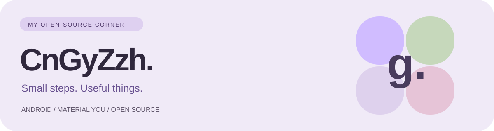

# Hi, I’m Gy 👋

Android tinkerer · Material You enthusiast · Open-source maker

[个人网站](https://cngyzzh.github.io) · [所有项目](https://github.com/CnGyZzh?tab=repositories) · [Telegram](https://t.me/CnGyZzh)

### 把想法，做成日常。

我是 **CnGyZzh**，关注 Android 个性化、系统工具和开源维护。希望把复杂的系统能力，打磨成更容易安装、使用和回滚的体验。

- **Android 个性化** — 探索 Material You / Monet 动态配色。
- **小而实用的工具** — 从日常需求出发，逐步改善体验。
- **清晰的文档** — 记录安装限制、兼容范围与回滚路径。

### 项目与仓库

| 项目 | 内容 | 入口 |
| :--- | :--- | :--- |
| **✦ WeType Monet** | 微信输入法 Material You / Monet 动态配色个人维护分支；提供 Overlay 与独立 APK 构建路线。 | [代码](https://github.com/CnGyZzh/WeType_Monet-Gy) · [下载](https://github.com/CnGyZzh/WeType_Monet-Gy/releases) |
| **⚡ HyperMax** | 面向 Xiaomi 17 Pro 的刷新率、触控与温控整合适配，含模块 WebUI。兼容条件见项目说明。 | [说明](https://github.com/CnGyZzh/HyperMax) · [下载](https://github.com/CnGyZzh/HyperMax/releases) |
| **↗ GitHub Level** | 自动抓取公开 GitHub 事件的文本归档与刷新日志。 | [仓库](https://github.com/CnGyZzh/Level) |
| **◒ 个人网站** | Material You 风格的项目索引、近况与发布记录。 | [网站](https://cngyzzh.github.io) · [源码](https://github.com/CnGyZzh/CnGyZzh.github.io) |
| **✧ Profile** | 当前 GitHub 主页的 README、视觉资源与贡献动画工作流。 | [仓库](https://github.com/CnGyZzh/CnGyZzh) |
| **ManifestAutoUpdate** | 历史仓库，当前无法访问，暂不提供功能与使用说明。 | [仓库入口](https://github.com/CnGyZzh/ManifestAutoUpdate) |

仓库清单核对于 2026-09-30。项目兼容性、下载内容与维护状态以各仓库说明及 Releases 为准。

### 开源足迹

[查看我的贡献、提交与讨论 →](https://github.com/CnGyZzh?tab=overview)

展开贡献动画

<picture>
  <source media="(prefers-color-scheme: dark)" srcset="https://raw.githubusercontent.com/CnGyZzh/CnGyZzh/output/github-contribution-grid-snake-dark.svg" />
  
</picture>

---

这个主页如何维护

编辑 [README.md](README.md) 更新介绍与项目表；[assets/banner.svg](assets/banner.svg) 是仓库内的横幅。[snake.yml](.github/workflows/snake.yml) 在推送、手动触发或定时运行时生成贡献动画，并发布到 output 分支。

Small steps. Useful things. Shared openly.
